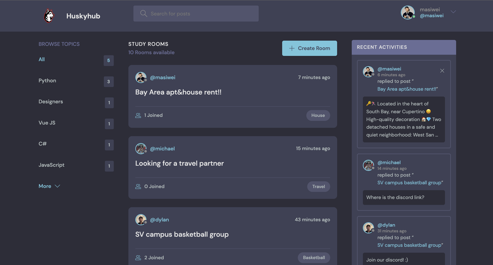
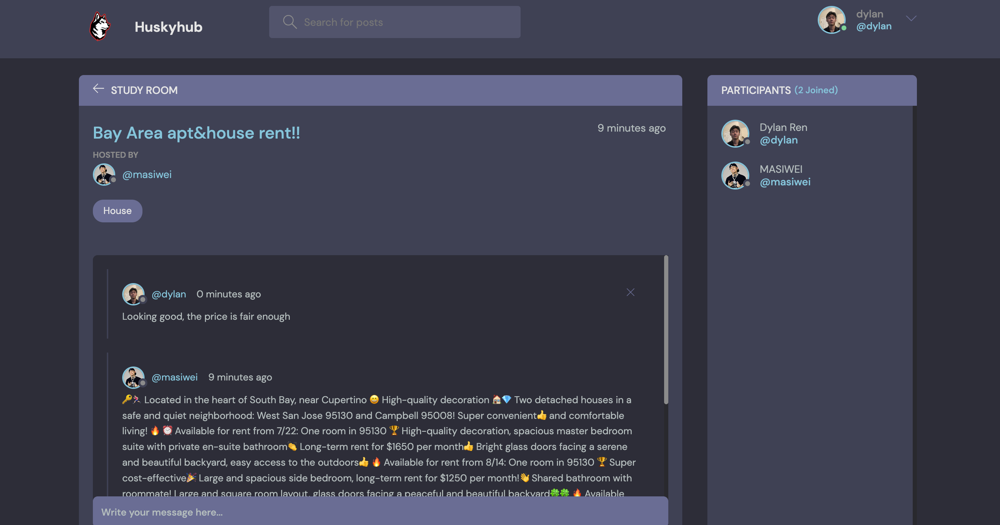

<div align="center">


# Huskyhub

Huskyhub is an original pioneer program designed by the Silicon Valley Hackers Club(Current developed by Dylan) to support student life and foster a community for students at Northeastern University to join and engage in discussions.
</div>

### App Preview :

<table width="100%"> 
<tr>
<td width="50%">      
&nbsp; 
<br>
<p align="center">
  Feed Home
</p>

</td> 
<td width="50%">
<br>
<p align="center">
  Room Conversation Preview
</p>
  
</td>
</table>

# Start The Project

--> Move into the directory where we have the project files : 
```bash
cd StudyBud

```

--> Create a virtual environment :
```bash
# Let's install virtualenv first
pip install virtualenv

# Then we create our virtual environment
virtualenv envname

```

--> Activate the virtual environment :
```bash
envname\scripts\activate

```mac
source env/bin/activate

--> Install the requirements :
```bash
pip install -r requirements.txt

```

#

### Running the App

--> To run the App, we use :
```bash
python manage.py runserver

```

> ⚠ Then, the development server will be started at http://127.0.0.1:8000/

#


